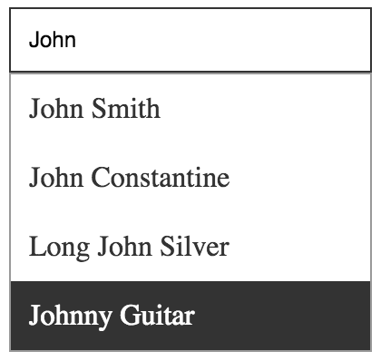

# ReactUI Autocomplete

An autocomplete input component for ReactJS that behaves like the love child of an input field and a select box.

_WARNING: This is in a very early stage of development!_



## Installation

Add to your project with `npm install react-ui-autocomplete` and include it using `import UIAutocomplete from 'react-ui-autocomplete'`.

## Usage

The component absolutely requires one property, an array of options to show to the user while typing. This array can either be an array of strings or an array of objects, the latter option requiring a little bit more configuration.

### Using an array of strings

To use an array of string, just pass it along in the `options` property:

```javascript
let options = ["One", "Two", "Three", "Four", "Five", "Six"]

return (
    <UIAutocomplete
        options={options}
    />
)
```

Now, after typing something in the input field, the suggestion box will pop up already filtered from your input.

### Using an array of objects

When using an array of objects, you must tell the component three additional things:

- Which property should be used to determine the "value". This is what gets passed back with the to the `onChange` event handler and is accessible through the component's `value` property. This is achieved by passing the property name to the `optionValue` property;
- Which properties should be filtered on. When you type something in the input field, the suggestions will be filtered on your input using the properties defined here. For example, you can filter on both the "name" and "surname" properties, and you can write either or both in the input field and the suggestions will be filtered accordingly. You can set either a string or an array of strings to the the `optionFilter` property;
- How the suggestions should be rendered: this is a function that returns a string representing the suggestion "label", starting from the object the suggestion represents. Pass this function to the `optionLabelRender` property;

```javascript
let options = [
    { id: 1, name: "John", surname: "Smith" },
    { id: 1, name: "John", surname: "Constantine" },
    { id: 1, name: "Long", surname: "John Silver"},
    { id: 1, name: "Johnny", surname: "Guitar" },
    { id: 2, name: "Rob", surname: "White" },
    { id: 3, name: "Frank", surname: "Black"}
]

return (
    <UIAutocomplete
        options={options}

        optionValue="id"
        optionFilter={['name', 'surname']}
        optionLabelRender={option => `${option.name} ${option.surname}`}
    />
)
```

### As a controlled component

Regardless of what you decide to pass to the `options` property, you can decide to make `UIAutocomplete` a controlled component. To do so, you simply need to define the `value` and `onChange` properties as you would on any other input component. The `onChange` property expects a callback that receives the `value`, the `displayValue` and the `suggestion` that has been selected to set the value (if any).

```javascript
let options = ["One", "Two", "Three", "Four", "Five", "Six"]
let value = ""
let handleValueChange = (newValue, displayValue, suggestion) => { value = newValue }

return (
    <UIAutocomplete
        options={options}

        value={value}
        onChange={handleValueChange}
    />
)
```

### Customizing the suggestion box behavior

There are three properties that you can set in order to customize how and when the suggestion box appears:

- The `suggestionMinimumInputChar` property determines how long the input must be before the box shows up. It defaults to `2`, but you can set it to `0` if you so desire;
- The `suggestionUpdateInterval` determines how long to wait before refreshing the suggestions following a user input. This allows the component to avoid filtering the `options` array on every keystroke. The default value is `300` milliseconds, but can be set to `0`;
- The `suggestionMaxCount` determines how many suggestions are shown at most in the suggestion box. The default value is `10`.

### Customizing appearance

You'll probably want to tweak how the component looks. Other than setting a `className` for the whole component, you can also pass a specific class to be used for the internal input field by setting the `inputClassName` property. You can (and should) also override the CSS classes already used to render the rest of the component. To do so, you can define the following classes in your own CSS: `.ui-autocomplete`, `.ui-autocomplete-suggestions`, `.ui-autocomplete-suggestion-item`, `.ui-autocomplete-suggestion-item.suggestion-focus`.

### Allowing arbitrary values (Experimental)

**NOTE: This is far from being final and I'm considering to remove it altogether**

If you don't want to limit the user input to the passed `options`, you can set to true the `allowNew` property. When using a simple string array, you don't have to do anything else:

```javascript
let options = ["One", "Two", "Three", "Four", "Five", "Six"]

return (
    <UIAutocomplete
        options={options}

        allowNew={true}
    />
)
```

At any point, the `value` property of the component will be set to whatever you've typed into the input field.

When using an object array, you need to tell the component which value to assign to the "unknown" input, since it's not part of the `options` array and the component has no way of knowing how you want to treat an unknown value. This is achieved by passing a function to the `computeNewValueFromInput` property, which receives the current input's value as its only parameter:

```javascript
let options = [
    { id: 1, name: "John", surname: "Smith" },
    { id: 1, name: "John", surname: "Constantine" },
    { id: 1, name: "Long", surname: "John Silver"},
    { id: 1, name: "Johnny", surname: "Guitar" },
    { id: 2, name: "Rob", surname: "White" },
    { id: 3, name: "Frank", surname: "Black"}
]

let value = null
let handleValueChange = (newValue, displayValue, suggestion) => {
    if (newValue !== 0) {
        value = options.find(o => o.id === newValue)
        return
    }

    value = {
        id: newValue,
        name: displayValue.split(' ').shift(),
        surname: displayValue.split(' ').pop()
    }
}

return (
    <UIAutocomplete
        options={options}

        optionValue="id"
        optionFilter={['name', 'surname']}
        optionLabelRender={option => `${option.name} ${option.surname}`}

        onChange={handleValueChange}

        allowNew={true}
        computeNewValueFromInput={ value => 0 }
    />
)
```

You can decide whether or not to require the user to press ENTER to confirm the new arbitrary value by setting the `newValueRequiresEnter` property. This property has no effect when `allowNew` is set to `false`, and its default value is `false`, so that `UIAutocomplete` behaves similarly to a regular input.

## Contributing

If you find that this thing breaks, you can open an issue and/or make a pull request. If you want to contribute, just pull the repository and make your modification. Don't forget to run the tests, and add your own where necessary!

The following `npm` scripts are available:

- `npm run build-dist`: creates a bundled version of the component, saving it to `dist`, using Webpack
- `npm run build-dev`: creates a development version of the component, saving it to `dev`, using Webpack
- `npm run demo`: runs a small demo application with WebpackDevServer. It's still in the works!
- `npm test`: runs the tests

## License

MIT
